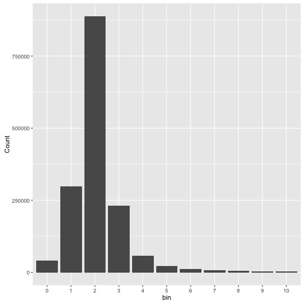
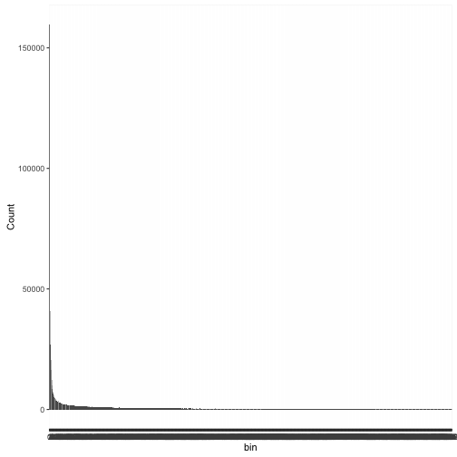
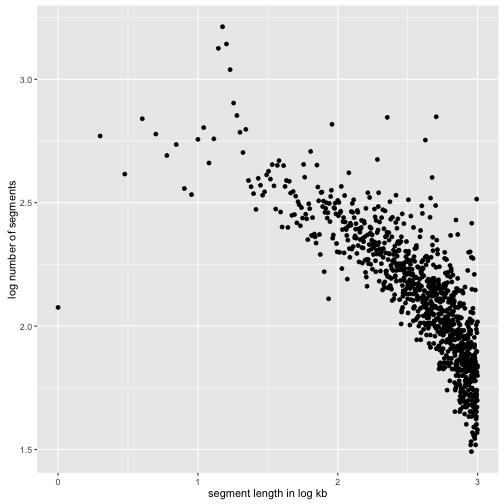
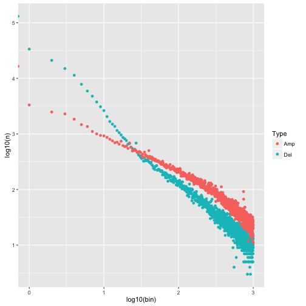
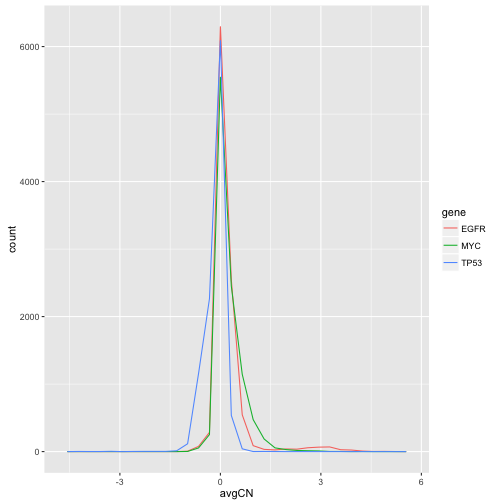

# Copy Number segments (Broad SNP6)

The goal of this notebook is to introduce you to the Copy Number (CN) segments BigQuery table.
This table contains all available TCGA Level-3 copy number data produced by the Broad Institute using the Affymetrix Genome Wide SNP6 array, as of October 2015. (Actual archive dates range from April 2011 to October 2014.) The most recent archives (eg broad.mit.edu_UCEC.Genome_Wide_SNP_6.Level_3.143.2013.0) for each of the 33 tumor types was downloaded from the DCC, and data extracted from all files matching the pattern %\_nocnv\_hg19.seg.txt. Each of these segmentation files has six columns: Sample, Chromosome, Start, End, Num_Probes, and Segment_Mean. During ETL the sample identifer contained in the segmentation files was mapped to the TCGA aliquot barcode based on the SDRF file in the associated mage-tab archive.

In order to work with BigQuery, you need to import the bigrquery library and you need to know the name(s) of the table(s) you are going to be working with:


```r
cnTable <- "[isb-cgc:tcga_201510_alpha.Copy_Number_segments]"
```

From now on, we will refer to this table using this variable 'cnTable', but we could just as well explicitly give the table name each time.
Let's start by taking a look at the table schema:


```r
querySql <- paste("SELECT * FROM ",cnTable," limit 1", sep="")
result <- query_exec(querySql, project=project)
data.frame(Columns=colnames(result))
```

```
##                 Columns
## 1    ParticipantBarcode
## 2         SampleBarcode
## 3  SampleTypeLetterCode
## 4        AliquotBarcode
## 5                 Study
## 6              Platform
## 7            Chromosome
## 8                 Start
## 9                   End
## 10           Num_Probes
## 11         Segment_Mean
```

Unlike most other molecular data types in which measurements are available for a common set of genes, CpG probes, or microRNAs, this data is produced using a data-driven approach for each aliquot independently. As a result, the number, sizes and positions of these segments can vary widely from one sample to another.

Each copy-number segment produced using the CBS (Circular Binary Segmentation) algorithm is described by the genomic extents of the segment (chromosome, start, and end), the number of SNP6 probes contained within that segment, and the estimated mean copy-number value for that segment. Each row in this table represents a single copy-number segment in a single sample.

The Segment_Mean is the base2 log(copynumber/2), centered at 0. Positive values represent amplifications (CN>2), and negative values represent deletions (CN<2). Although within each cell, the number of copies of a particular region of DNA must be an integer, these measurements are not single-cell measurements but are based on a heterogenous sample. If 50% of the cells have 2 copies of a particular DNA segment, and 50% of the cells have 3 copies, this will result in an estimated copy number value of 2.5, which becomes 1.32 after the log transformation.

Let's count up the number of unique patients, samples and aliquots mentioned in this table. We will do this by defining a very simple parameterized query. (Note that when using a variable for the table name in the FROM clause, you should not also use the square brackets that you usually would if you were specifying the table name as a string.)


```r
for (x in c("ParticipantBarcode", "SampleBarcode", "AliquotBarcode")) {
  querySql <- paste("SELECT COUNT(DISTINCT(",x,"), 25000) AS n ",
                    "FROM ",cnTable)
  result <- query_exec(querySql, project=project)
  cat(x, ": ", result[[1]], "\n")
}
```

```
## ParticipantBarcode :  10953 
## SampleBarcode :  21890 
## AliquotBarcode :  22106
```

Unlike most other molecular data types, in addition to data being available from each tumor sample, data is also typically available from a matched "blood normal" sample. As we can see from the previous queries, there are roughly twice as many samples as there are patients (aka participants). The total number of rows in this table is ~2.5 million, and the average number of segments for each aliquot is ~116 (although the distribution is highly skewed as we will see shortly).

Let's count up the number of samples using the ``SampleTypeLetterCode`` field:


```r
querySql <- "
SELECT
  SampleTypeLetterCode,
  COUNT(*) AS n
FROM (
  SELECT
    SampleTypeLetterCode,
    SampleBarcode
  FROM
    [isb-cgc:tcga_201510_alpha.Copy_Number_segments]
  GROUP BY
    SampleTypeLetterCode,
    SampleBarcode )
GROUP BY
  SampleTypeLetterCode
ORDER BY
  n DESC"

query_exec(querySql, project=project)
```

```
##   SampleTypeLetterCode     n
## 1                   TP 10254
## 2                   NB  8730
## 3                   NT  2247
## 4                   TM   392
## 5                   TB   191
## 6                   TR    59
## 7                  TAP     9
## 8                  NBC     4
## 9                  NBM     4
```

As shown in the results of this last query, most samples are primary tumor samples (TP), and in most cases the matched-normal sample is a "normal blood" (NB) sample, although many times it is a "normal tissue" (NT) sample. You can find a description for each of these sample type codes in the TCGA Code Tables Report.
In order to get a better feel for the data in this table, let's take a look at the range of values and the distributions of segment lengths, mean segment values, and number of probes contributing to each segment.


```r
querySql <- "
SELECT
  MIN(Length) AS minLength,
  MAX(Length) AS maxLength,
  AVG(Length) AS avgLength,
  STDDEV(Length) AS stdLength,
  MIN(Num_Probes) AS minNumProbes,
  MAX(Num_Probes) AS maxNumProbes,
  AVG(Num_Probes) AS avgNumProbes,
  STDDEV(Num_Probes) AS stdNumProbes,
  MIN(Segment_Mean) AS minCN,
  MAX(Segment_Mean) AS maxCN,
  AVG(Segment_Mean) AS avgCN,
  STDDEV(Segment_Mean) AS stdCN,
FROM (
  SELECT
    Start,
    END,
    (END-Start+1) AS Length,
    Num_Probes,
    Segment_Mean
  FROM
    [isb-cgc:tcga_201510_alpha.Copy_Number_segments] )"

result <- query_exec(querySql, project=project)
t(result)
```

```
##                          1
## minLength     1.000000e+00
## maxLength     2.445951e+08
## avgLength     2.474561e+07
## stdLength     4.408090e+07
## minNumProbes  1.000000e+00
## maxNumProbes  1.313610e+05
## avgNumProbes  1.332859e+04
## stdNumProbes  2.368022e+04
## minCN        -8.673300e+00
## maxCN         1.054680e+01
## avgCN        -2.617346e-01
## stdCN         9.941424e-01
```

Segment lengths range from just 1 bp all the way up to entire chromosome arms, and the range of segment mean values is from -8.7 to +10.5 (average = -0.26, standard deviation = 1.0)

Now we'll use ggplot2 to create some simple visualizations.

For the segment means, let's invert the log-transform and then bin the values to see what the distribution looks like:


```r
querySql <- "
SELECT
  lin_bin,
  COUNT(*) AS n
FROM (
  SELECT
    Segment_Mean,
    (2.*POW(2,Segment_Mean)) AS lin_CN,
    INTEGER(((2.*POW(2,Segment_Mean))+0.50)/1.0) AS lin_bin
  FROM
    [isb-cgc:tcga_201510_alpha.Copy_Number_segments]
  WHERE
    ( (End-Start+1)>1000 AND SampleTypeLetterCode='TP' )
  )
GROUP BY
  lin_bin
HAVING
  ( n > 2000 )
ORDER BY
  lin_bin ASC"

result <- query_exec(querySql, project=project)

ggplot(data=result, aes(x=factor(lin_bin), y=n)) +
geom_bar(stat="identity") + xlab("bin") + ylab("Count")
```



The histogram illustrates that the vast majority of the CN segments have a copy-number value near 2, as expected, with significant tails on either side representing deletions (left) and amplifications (right).

Let's take a look at the distribution of segment lengths now. First we'll use 1Kb bins and look at segments with lengths up to 1 Mb.


```r
querySql <- "
SELECT
  bin,
  COUNT(*) AS n
FROM (
  SELECT
    (END-Start+1) AS segLength,
    INTEGER((END-Start+1)/1000) AS bin
  FROM
    [isb-cgc:tcga_201510_alpha.Copy_Number_segments]
  WHERE
    (END-Start+1)<1000000 AND SampleTypeLetterCode='TP' )
GROUP BY
  bin
ORDER BY
  bin ASC"

result <- query_exec(querySql, project=project)

ggplot(data=result, aes(x=factor(bin), y=n)) +
geom_bar(stat="identity") + xlab("bin") + ylab("Count")
```



As expected, shorter segment lengths dominate, and between 1Kb and 1Mb it appears that segment lengths follow a power-law distribution.

Let's have a closer look at the shorter segments, under 1Kb in length:


```r
querySql <- "
SELECT
  bin,
  COUNT(*) AS n
FROM (
  SELECT
    (END-Start+1) AS segLength,
    INTEGER((END-Start+1)/1) AS bin
  FROM
    [isb-cgc:tcga_201510_alpha.Copy_Number_segments]
  WHERE
    (END-Start+1)<1000 AND SampleTypeLetterCode='TP'
  )
GROUP BY
  bin
ORDER BY
  bin ASC"

result <- query_exec(querySql, project=project)

qplot(x=log10(bin), y=log10(n), data=result, ylab="log number of segments", xlab="segment length in log kb")
```



At this finer scale, we see that the most comment segment length is ~15bp.

Let's go back and take another look at the medium-length CN segments and see what happens when we separate out the amplifications and deletions. We'll use queries similar to the getSLhist_1k query above, but add another WHERE clause to look at amplifications and deletions respectively.


```r
querySql1 <- "
SELECT
  bin,
  COUNT(*) AS n
FROM (
  SELECT
    (END-Start+1) AS segLength,
    INTEGER((END-Start+1)/1000) AS bin
  FROM
    [isb-cgc:tcga_201510_alpha.Copy_Number_segments]
  WHERE
    (END-Start+1)<1000000 AND SampleTypeLetterCode='TP' AND Segment_Mean<-0.7 )
GROUP BY
  bin
ORDER BY
  bin ASC
"

querySql2 <- "
SELECT
  bin,
  COUNT(*) AS n
FROM (
  SELECT
    (END-Start+1) AS segLength,
    INTEGER((END-Start+1)/1000) AS bin
  FROM
    [isb-cgc:tcga_201510_alpha.Copy_Number_segments]
  WHERE
    (END-Start+1)<1000000 AND SampleTypeLetterCode='TP' AND Segment_Mean>0.7 )
GROUP BY
  bin
ORDER BY
  bin ASC
"

SLhistDel <- query_exec(querySql1, project=project)
SLhistAmp <- query_exec(querySql2, project=project)
SLhistDel$Type <- "Del"
SLhistAmp$Type <- "Amp"
SLhist <- rbind(SLhistDel,SLhistAmp)
qplot(data=SLhist, x=log10(bin), y=log10(n), color=Type)
```



The amplification and deletion distributions are nearly identical and still seem to roughly follow a power-law distribution. We can also infer from this graph that a majority of the segments less than 10Kb in length are either amplifications or deletions, while ~90% of the segments of lengths >100Kb are copy-number neutral.

Before we leave this dataset, let's look at how we might analyze the copy-number as it relates to a particular gene of interest. This next parameterized query looks for all copy-number segments overlapping a specific genomic region and computes some statistics after grouping by sample.


```r
genes <- c("EGFR", "MYC", "TP53")
geneChr <- c(7, 8, 17)
geneStart <- c(55086725, 128748315, 7571720)
geneStop <- c(55275031, 128753680, 7590868)

allResults <- data.frame()

for (i in 1:length(genes)) {
    querySql <- paste(
    "SELECT
      SampleBarcode,
      AVG(Segment_Mean) AS avgCN,
      MIN(Segment_Mean) AS minCN,
      MAX(Segment_Mean) AS maxCN,
    FROM ",
      cnTable,
    "WHERE
      ( SampleTypeLetterCode='TP'
        AND Num_Probes > 10
        AND Chromosome=\'",geneChr[i],"\' ",
        "AND ( (Start<", geneStart[i], " AND End> ", geneStop[i], ")",
           "OR (Start<", geneStop[i], " AND End> ",geneStop[i], ")",
           "OR (Start>", geneStart[i], " AND End< ",geneStop[i], ") ) )",
    "GROUP BY
      SampleBarcode", sep="")

    result <- query_exec(querySql, project=project)
    result$gene <- genes[i]
    allResults <- rbind(allResults, result)
}
ggplot(allResults, aes(avgCN, colour=gene)) + geom_freqpoly(aes(group = gene))
```

```
## `stat_bin()` using `bins = 30`. Pick better value with `binwidth`.
```


